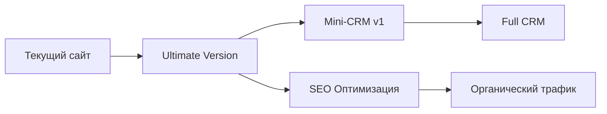

# 🚀 ROADMAP: AVTOGOST ULTIMATE VERSION

> **Стратегический план развития проекта с учетом будущей CRM**

## 📊 ОБЩАЯ СТРАТЕГИЯ



## 🎯 ФАЗА 1: ПОДГОТОВКА (1 неделя)

### Неделя 1: Планирование и архитектура
- [ ] **День 1-2: Мозговой штурм**
  - Финализация списка функций
  - Приоритизация по важности
  - Согласование с Визионером
  
- [ ] **День 3-4: Техническая архитектура**
  - Выбор финального стека
  - Проектирование БД с учетом CRM
  - API структура
  
- [ ] **День 5-7: Дизайн-система**
  - UI/UX концепция
  - Компонентная библиотека
  - Мобильная адаптация

## 🏗️ ФАЗА 2: РАЗРАБОТКА ULTIMATE VERSION (3-4 недели)

### Неделя 2: Базовая инфраструктура
- [ ] **Backend основа**
  - Next.js + TypeScript setup
  - Prisma + PostgreSQL
  - JWT авторизация
  - API endpoints структура
  
- [ ] **Frontend база**
  - Компонентная архитектура
  - future-2030 стили (от Sonnet)
  - Система роутинга
  - SEO оптимизация

### Неделя 3: Ключевые функции
- [ ] **AI Калькулятор 2.0**
  - Улучшенный алгоритм
  - Голосовой ввод
  - Сохранение расчетов в БД
  
- [ ] **Умные формы**
  - Прогрессивное заполнение
  - Валидация в реальном времени
  - Интеграция с БД
  
- [ ] **Интерактивная карта**
  - Визуализация маршрутов
  - Расчет в реальном времени
  - Анимации

### Неделя 4: Воронка продаж
- [ ] **Landing страницы**
  - Главная с WOW-эффектом
  - Страницы для каждого маршрута
  - Локальные страницы для SEO
  
- [ ] **Конверсионные элементы**
  - Sticky CTA кнопки
  - Exit-intent попапы
  - Social proof виджеты
  
- [ ] **Чат-бот "Логист Гоша"**
  - Персонаж с характером
  - Быстрые ответы
  - Сбор контактов

### Неделя 5: Оптимизация и тесты
- [ ] **Performance**
  - Достижение 95+ PageSpeed
  - Оптимизация изображений
  - Lazy loading
  - Edge caching
  
- [ ] **A/B тестирование**
  - Разные версии CTA
  - Варианты форм
  - Позиционирование элементов

## 📈 ФАЗА 3: ЗАПУСК И SEO (2 недели)

### Неделя 6: Запуск
- [ ] **Деплой на продакшн**
  - Настройка хостинга
  - SSL сертификаты
  - Мониторинг
  - Backup система
  
- [ ] **Контент**
  - SEO тексты
  - Блог статьи
  - FAQ раздел
  - Кейсы клиентов

### Неделя 7: SEO машина
- [ ] **Техническое SEO**
  - Sitemap.xml
  - Robots.txt
  - Schema.org разметка
  - Meta теги
  
- [ ] **Контентное SEO**
  - 50+ landing страниц
  - Оптимизация под запросы
  - Внутренняя перелинковка
  - Локальное продвижение

## 🔮 ФАЗА 4: ПОДГОТОВКА К CRM (параллельно)

### Что делаем с первого дня:
- [ ] **База данных**
  ```sql
  - Таблица: clients (имя, телефон, email, источник)
  - Таблица: orders (клиент, маршрут, статус, сумма)
  - Таблица: interactions (тип, дата, результат)
  - Таблица: users (для будущих менеджеров)
  ```

- [ ] **API endpoints**
  ```yaml
  /api/leads - создание/получение лидов
  /api/orders - заказы
  /api/clients - клиенты
  /api/analytics - статистика
  /api/export - экспорт в Excel
  ```

- [ ] **Админ-зона (скрытая)**
  - /admin роутинг готов
  - Базовая авторизация
  - Заготовка интерфейса

## 📊 МЕТРИКИ УСПЕХА

### Технические:
- PageSpeed: 95+
- Время загрузки: < 2 сек
- Mobile-friendly: 100%
- SEO оценка: 95+

### Бизнес:
- Конверсия: 3-5%
- Органический трафик: +200% за 3 месяца
- Стоимость лида: -50%
- LTV клиента: +30%

## 🛠️ ТЕХНОЛОГИЧЕСКИЙ СТЕК

```yaml
Frontend:
  - Next.js 14
  - TypeScript
  - Tailwind CSS + future-2030 система
  - Framer Motion (анимации)
  
Backend:
  - Next.js API Routes
  - Prisma ORM
  - PostgreSQL
  - JWT + NextAuth
  
Инфраструктура:
  - Vercel (или VPS)
  - Cloudflare CDN
  - GitHub Actions (CI/CD)
  - Sentry (мониторинг)
  
Интеграции:
  - Telegram Bot API
  - WhatsApp Business API
  - Email (SendGrid)
  - SMS (SMS.ru)
```

## 🎯 ПРИОРИТЕТЫ

### MUST HAVE (Обязательно):
1. AI калькулятор
2. Умные формы с БД
3. Mobile-first дизайн
4. SEO оптимизация
5. Базовая аналитика

### SHOULD HAVE (Желательно):
1. Чат-бот
2. Интерактивная карта
3. A/B тестирование
4. Push уведомления
5. Личный кабинет (базовый)

### NICE TO HAVE (Было бы круто):
1. AR визуализация
2. Голосовой помощник
3. Геймификация
4. Видео-консультации
5. AI-предсказания цен

## 📅 TIMELINE

```
Неделя 1: ████░░░░░░ Планирование
Неделя 2: ████░░░░░░ Инфраструктура  
Неделя 3: ████░░░░░░ Ключевые функции
Неделя 4: ████░░░░░░ Воронка продаж
Неделя 5: ████░░░░░░ Оптимизация
Неделя 6: ████░░░░░░ Запуск
Неделя 7: ████░░░░░░ SEO машина
```

**Итого: 7 недель до полного запуска Ultimate Version**

## 🤝 РАСПРЕДЕЛЕНИЕ ЗАДАЧ

### Opus (я):
- Backend архитектура
- API разработка
- Оптимизация производительности
- Деплой и инфраструктура
- Интеграции

### Sonnet:
- Frontend разработка
- UI/UX дизайн
- Анимации и интерактив
- Компонентная система
- A/B тестирование

### Визионер:
- Контент и тексты
- Бизнес-логика
- Приоритизация функций
- Тестирование UX
- Обратная связь

---

**🚀 ГОТОВЫ К СТАРТУ! ЖДЕМ ОБРАТНУЮ СВЯЗЬ ОТ КОМАНДЫ!**